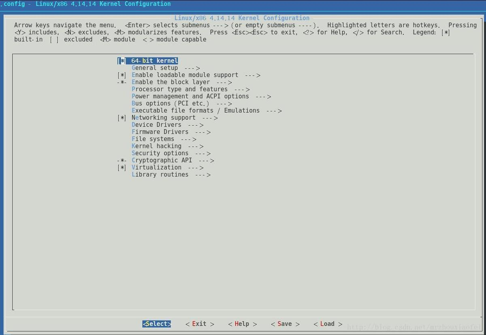

# 内核编译

[TOC]

## 相关网站

[内核源码包下载路径](https://mirrors.edge.kernel.org/pub/linux/kernel/)  或     

 [sjtu 国内源](http://ftp.sjtu.edu.cn/sites/ftp.kernel.org/pub/linux/kernel/)  以及 更早版本如0.11版本下载  http://ftp.sjtu.edu.cn/sites/ftp.kernel.org/pub/linux/kernel/Historic/old-versions/

 [如何编译安装Linux内核](https://www.cnblogs.com/harrypotterjackson/p/11846222.html)

[内核编译：操作系统实验一 ：向Linux内核增加一个系统调用](https://blog.csdn.net/qq_36172505/article/details/80372029)

[内核版本和centos版本对照](https://access.redhat.com/articles/3078)

[kernel rpm source](https://vault.centos.org/7.6.1810/os/Source/SPackages/)


## 配置kernel

> **make menuconfig**



会看到图上

- 带*号的行，是选中的意识，也就是，我们将把这个驱动模块编译到内核中去
- 带M号的意识是，它将以一个模块方式存在          
- 为空[ ]的，意识是没有使用此功能

   （实际在一些做嵌入式系统工作中，会根据需要，选择很少的功能，选的越少，启动越快，也会相对稳定）

## 编译安装

**这里我们不做改动，默认即可，退出后，在当前目录下，开始编译**

```shell
## 可能需要这些依赖 
# yum install -y gcc gcc-c++ ncurses-devel elfutils-libelf-devel openssl-devel bc perl perl-devel
# yum install -y flex bison
## A:
# make -j4        # 4为cpu核数，可以通过lscpu查看，加上j4编译会快一些。
# make bzImage     (时间较长可以，根据自己系统配置情况可以选用 # make -j4)      #编译安装
# make modules

## B:
# make -j4 all

## 执行A 或 B。


# make modules_install        #加载模块
# make install                #最后一步安装kernel

## 这里完成后，会自动帮我们修改好grub文件信息，不用自己再做修改了
#reboot
```

重启机器即可

## 制作rpm包

**如需制作RPM内核安装包，就不需要运行以上Make步骤，解压后进入目录**

make rpm 执行会自动生成 *.spec 文件，编译完后会自动生成 rmp 安装包

```shell
## 需要这些依赖 
# yum install -y gcc rpm-build rpm-devel rpmlint make python bash coreutils diffutils patch rpmdevtools

# make rpm （时间较长）
```


完成后，rpm包生成位置（一般会在/root/rpmbuild/RPMS/下）：


验证内核启动项：

```shell
# grub2-editenv list
    saved_entry=CentOS Linux (4.14.124.x86_64) 7 (Core)
```

## 错误问题

### Makefile:434: *** mixed implicit and normal rules.  Stop.

```shell
[root@192 linux-2.6.24]# make menuconfig
Makefile:434: *** mixed implicit and normal rules.  Stop.
```

解决办法：

```makefile
## make太新，不兼容旧版本的makefile。
## 1、    config %config: scripts_basic outputmakefile FORCE
## 修改为         %config: scripts_basic outputmakefile FORCE
##2、    / %/: prepare scripts FORCE
## 修改为   %/: prepare scripts FORCE 
```

### gcc: error: elf_x86_64: No such file or directory

```shell
[root@192 linux-2.6.24]# make -j2
  CHK     include/linux/version.h
  CHK     include/linux/utsrelease.h
  CALL    scripts/checksyscalls.sh
  CHK     include/linux/compile.h
  SYSCALL arch/x86/vdso/vdso.so.dbg
gcc: error: elf_x86_64: No such file or directory
gcc: error: unrecognized command line option ‘-m’
make[1]: *** [arch/x86/vdso/vdso.so.dbg] Error 1
make: *** [arch/x86/vdso] Error 2
[root@192 linux-2.6.24]#
### 或 elf_i386找不到
```

解决办法：

```makefile
## gcc版本较新
## arch/x86/vdso/Makefile
## 将：   -m elf_x86_64  
## 修改为 -m64

## 将:    -m elf_i386
## 修改为  -m32
```

### 2.6.24内核： /tmp/ccg3c4Im.s: Error: .size expression for copy_user_generic_c does not evaluate to a constant

```shell
# make bzImage
...
/tmp/ccg3c4Im.s: Assembler messages:
/tmp/ccg3c4Im.s: Error: .size expression for copy_user_generic_c does not evaluate to a constant
make[1]: *** [arch/x86/lib/copy_user_64.o] Error 1
make: *** [arch/x86/lib] Error 2
```

解决办法：

```shell
# 修改： 
# vi arch/x86/lib/copy_user_64.S
##    END(copy_user_generic_c)  
## 为 END(copy_user_generic_string)
##和 ENTRY(copy_user_generic_string) 保持一致。
```

### 2.6.24内核 undefined reference to `__mutex_lock_slowpath'

```shell
# make bzImage
kernel/built-in.o: In function `mutex_lock':
/usr/src/linux-2.6.24/kernel/mutex.c:92: undefined reference to `__mutex_lock_slowpath'
kernel/built-in.o: In function `mutex_unlock':
/usr/src/linux-2.6.24/kernel/mutex.c:118: undefined reference to `__mutex_unlock_slowpath'
make: *** [.tmp_vmlinux1] Error 1
[root@192 linux-2.6.24]# vi kernel/mutex.c
```

解决办法：

```shell
## kernel/mutex.c 文件中找到  __mutex_lock_slowpath 和 __mutex_unlock_slowpath 函数的声明和定义的地方：
## 添加 __used.
## 如：   static void fastcall noinline __sched
## 修改为 static __used void fastcall noinline __sched

## 如：   static fastcall noinline void
## 修改为 static __used fastcall noinline void
```

2.6.24 getline冲突：

```shell
## scripts/unifdef.c 中的 getline 与 gcc编译过程中/usr/include/stdio.h用的getline函数冲突
scripts/unifdef.c:209:25: error: conflicting types for ‘getline’
 static Linetype         getline(void);
                         ^
In file included from scripts/unifdef.c:70:0:
/usr/include/stdio.h:678:20: note: previous declaration of ‘getline’ was here
 extern _IO_ssize_t getline (char **__restrict __lineptr,
                    ^
make[2]: *** [scripts/unifdef] Error 1
```

解决办法：

```shell
### 修改 scripts/unifdef.c 中的 getline 为 parseline
### 如：共 三处
- static Linetype getline(void);
+ static Linetype parseline(void);
```

### 416 “mixed implicit and normal rules”

```makefile
## 修改makefile
修改  config %config: scripts_basic outputmakefile FORCE
为           %config: scripts_basic outputmakefile FORCE
```


### 缺少modules.order 和 modules.builtin


### gcc版本过低，编译5.10.11版本内核

```shell
[root@bogon linux-5.10.11]# make -j2 bzImage
  DESCEND  objtool
  CC      scripts/mod/empty.o
In file included from ././include/linux/compiler_types.h:74:0,
                 from <command-line>:0:
./include/linux/compiler-gcc.h:15:3: error: #error Sorry, your version of GCC is too old - please use 4.9 or newer.
 # error Sorry, your version of GCC is too old - please use 4.9 or newer.
   ^
make[2]: *** [scripts/mod/empty.o] Error 1
make[1]: *** [prepare0] Error 2
make[1]: *** Waiting for unfinished jobs....
make: *** [__sub-make] Error 2
[root@bogon linux-5.10.11]#
```

解决办法：升级内核 到 5.1.0

[Linux(CentOS)升级gcc版本](https://www.cnblogs.com/edda/p/13061554.html)

[Linux升级gcc到最新版本--gcc-9.2.0](https://www.cnblogs.com/chen55555/p/12396309.html)

### ubuntu编译 2.6.34

#### Install ncurses (ncurses-devel) and try again.

>  apt-get install libncurses5-dev

#### cc1: error: code model kernel does not support PIC mode

```makefile
## Makefile文件 追加 fno-pie
KBUILD_CFLAGS = ...\
	-fno-pie
```

