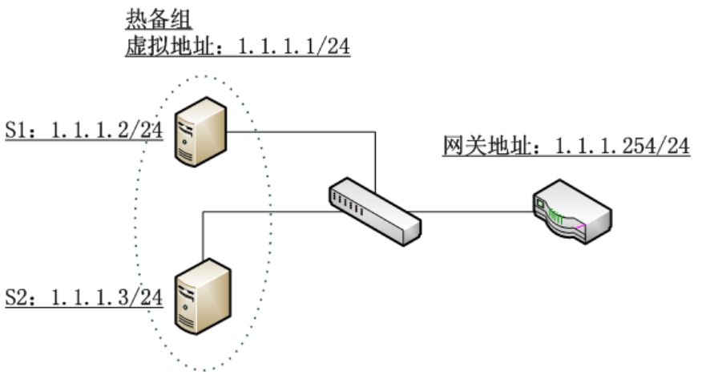

# Linux实现的ARP缓存老化时间原理解析

[Linux实现的ARP缓存老化时间原理解析](https://blog.csdn.net/dog250/article/details/7251689#)

# 一.问题

众所周知，ARP是一个链路层的地址解析协议，它以IP地址为键值，查询保有该IP地址主机的MAC地址。协议的详情就不详述了，你可以看RFC，也可以看教科书。这里写这么一篇文章，主要是为了做一点记录，同时也为同学们提供一点思路。具体呢，我遇到过两个问题：

1. 使用keepalived进行热备份的系统需要一个虚拟的IP地址，然而该虚拟IP地址到底属于哪台机器是根据热备群的主备来决定的，因此主机器在获得该虚拟IP的时候，必须要广播一个免费的arp，起初人们认为这没有必要，理由是不这么做，热备群也工作的很好，然而事实证明，这是必须的；

2. ARP缓存表项都有一个老化时间，然而在linux系统中却没有给出具体如何来设置这个老化时间。那么到底怎么设置这个老化时间呢？

# 二.解答问题前的说明

ARP协议的规范只是阐述了地址解析的细节，然而并没有规定协议栈的实现如何去维护ARP缓存。ARP缓存需要有一个到期时间，这是必要的，因为ARP缓存并不维护映射的状态，也不进行认证，因此协议本身不能保证这种映射永远都是正确的，它只能保证该映射在得到arp应答之后的一定时间内是有效的。这也给了ARP欺骗以可乘之机，不过本文不讨论这种欺骗。
  像Cisco或者基于VRP的华为设备都有明确的配置来配置arp缓存的到期时间，然而Linux系统中却没有这样的配置，起码可以说没有这样的直接配置。Linux用户都知道如果需要配置什么系统行为，那么使用sysctl工具配置procfs下的sys接口是一个方法，然而当我们google了好久，终于发现关于ARP的配置处在/proc/sys/net/ipv4/neigh/ethX的时候，我们最终又迷茫于该目录下的N多文件，即使去查询Linux内核的Documents也不能清晰的明了这些文件的具体含义。对于Linux这样的成熟系统，一定有办法来配置ARP缓存的到期时间，但是具体到操作上，到底怎么配置呢？这还得从Linux实现的ARP状态机说起。
  如果你看过 *《Understading Linux Networking Internals》* 并且真的做到深入理解的话，那么本文讲的基本就是废话，但是很多人是没有看过那本书的，因此本文的内容还是有一定价值的。
  Linux协议栈实现为ARP缓存维护了一个状态机，在理解具体的行为之前，先看一下下面的图(该图基于 ***《Understading Linux Networking Internals》*** 里面的图26-13修改，在第二十六章)：

在上图中，我们看到只有arp缓存项的reachable状态对于外发包是可用的，对于stale状态的arp缓存项而言，它实际上是不可用的。如果此时有人要发包，那么需要进行重新解析，对于常规的理解，重新解析意味着要重新发送arp请求，然后事实上却不一定这样，因为Linux为arp增加了一个“事件点”来“不用发送arp请求”而对arp协议生成的缓存维护的优化措施，事实上，这种措施十分有效。这就是arp的“确认”机制，也就是说，如果说从一个邻居主动发来一个数据包到本机，那么就可以确认该包的“上一跳”这个邻居是有效的，然而为何只有到达本机的包才能确认“上一跳”这个邻居的有效性呢？因为Linux并不想为IP层的处理增加负担，也即不想改变IP层的原始语义。
  Linux维护一个stale状态其实就是为了保留一个neighbour结构体，在其状态改变时只是个别字段得到修改或者填充。如果按照简单的实现，只保存一个reachable状态即可，其到期则删除arp缓存表项。Linux的做法只是做了很多的优化，但是如果你为这些优化而绞尽脑汁，那就悲剧了...

# 三.Linux如何来维护这个stale状态

在Linux实现的ARP状态机中，最复杂的就是stale状态了，在此状态中的arp缓存表项面临着生死抉择，抉择者就是本地发出的包，如果本地发出的包使用了这个stale状态的arp缓存表项，那么就将状态机推进到delay状态，如果在“垃圾收集”定时器到期后还没有人使用该邻居，那么就有可能删除这个表项了，到底删除吗？这样看看有木有其它路径使用它，关键是看路由缓存，路由缓存虽然是一个第三层的概念，然而却保留了该路由的下一条的ARP缓存表项，这个意义上，Linux的路由缓存实则一个转发表而不是一个路由表。
  如果有外发包使用了这个表项，那么该表项的ARP状态机将进入delay状态，在delay状态中，只要有“本地”确认的到来(本地接收包的上一跳来自该邻居)，linux还是不会发送ARP请求的，但是如果一直都没有本地确认，那么Linux就将发送真正的ARP请求了，进入probe状态。因此可以看到，从stale状态开始，所有的状态只是为一种优化措施而存在的，stale状态的ARP缓存表项就是一个缓存的缓存，如果Linux只是将过期的reachable状态的arp缓存表项删除，语义是一样的，但是实现看起来以及理解起来会简单得多！
  再次强调，reachable过期进入stale状态而不是直接删除，是为了保留neighbour结构体，优化内存以及CPU利用，实际上进入stale状态的arp缓存表项时不可用的，要想使其可用，要么在delay状态定时器到期前本地给予了确认，比如tcp收到了一个包，要么delay状态到期进入probe状态后arp请求得到了回应。否则还是会被删除。

# 四.Linux的ARP缓存实现要点

在blog中分析源码是儿时的记忆了，现在不再浪费版面了。只要知道Linux在实现arp时维护的几个定时器的要点即可。
1.Reachable状态定时器
每当有arp回应到达或者其它能证明该ARP表项表示的邻居真的可达时，启动该定时器。到期时根据配置的时间将对应的ARP缓存表项转换到下一个状态。
2.垃圾回收定时器
定时启动该定时器，具体下一次什么到期，是根据配置的base_reachable_time来决定的，具体见下面的代码：

```c
static void neigh_periodic_timer(unsigned long arg) 
{ 
  ... 
  if (time_after(now, tbl->last_rand + 300 * HZ)) { //内核每5分钟重新进行一次配置 
    struct neigh_parms *p; 
    tbl->last_rand = now; 
    for (p = &tbl->parms; p; p = p->next) 
      p->reachable_time = 
        neigh_rand_reach_time(p->base_reachable_time); 
   } 
   ... 
  
    /* Cycle through all hash buckets every base_reachable_time/2 ticks. 
    \* ARP entry timeouts range from 1/2 base_reachable_time to 3/2 
    \* base_reachable_time. 
    */ 
   expire = tbl->parms.base_reachable_time >> 1; 
   expire /= (tbl->hash_mask + 1); 
   if (!expire) 
		expire = 1; 
   //下次何时到期完全基于base_reachable_time); 
    mod_timer(&tbl->gc_timer, now + expire); 
   ... 
 }
```


一旦这个定时器到期，将执行neigh_periodic_timer回调函数，里面有以下的逻辑，也即上面的...省略的部分：

```c
if (atomic_read(&n->refcnt) == 1 && //n->used可能会因为“本地确认”机制而向前推进
    (state == NUD_FAILED ||    time_after(now, n->used + n->parms->gc_staletime))) {
    *np = n->next;
    n->dead = 1;
    write_unlock(&n->lock);
    neigh_release(n);
    continue;
}
```


如果在实验中，你的处于stale状态的表项没有被及时删除，那么试着执行一下下面的命令：

```shell
# ip route flush cache
```

然后再看看ip neigh ls all的结果，注意，不要指望马上会被删除，因为此时垃圾回收定时器还没有到期呢...但是我敢保证，不长的时间之后，该缓存表项将被删除。

# 五.第一个问题的解决

在启用keepalived进行基于vrrp热备份的群组上，很多同学认为根本不需要在进入master状态时重新绑定自己的MAC地址和虚拟IP地址，然而这是根本错误的，如果说没有出现什么问题，那也是侥幸，因为各个路由器上默认配置的arp超时时间一般很短，然而我们不能依赖这种配置。请看下面的图示：

如果发生了切换，假设路由器上的arp缓存超时时间为1小时，那么在将近一小时内，单向数据将无法通信(假设群组中的主机不会发送数据通过路由器，排出“本地确认”，毕竟我不知道路由器是不是在运行Linux)，路由器上的数据将持续不断的法往原来的master，然而原始的matser已经不再持有虚拟IP地址。
  因此，为了使得数据行为不再依赖路由器的配置，必须在vrrp协议下切换到master时手动绑定虚拟IP地址和自己的MAC地址，在Linux上使用方便的arping则是：

```shell
# arping -i ethX -S 1.1.1.1 -B -c 1
```

这样一来，获得1.1.1.1这个IP地址的master主机将IP地址为255.255.255.255的ARP请求广播到全网，假设路由器运行Linux，则路由器接收到该ARP请求后将根据来源IP地址更新其本地的ARP缓存表项(如果有的话)，然而问题是，该表项更新的结果状态却是stale，这只是ARP的规定，具体在代码中体现是这样的，在arp_process函数的最后：

```c
if (arp->ar_op != htons(ARPOP_REPLY) || skb->pkt_type != PACKET_HOST)
    state = NUD_STALE;
neigh_update(n, sha, state, override ? NEIGH_UPDATE_F_OVERRIDE : 0);
```

由此可见，只有实际的外发包的下一跳是1.1.1.1时，才会通过“本地确认”机制或者实际发送ARP请求的方式将对应的MAC地址映射reachable状态。

更正：在看了keepalived的源码之后，发现这个担心是多余的，毕竟keepalived已经很成熟了，不应该犯“如此低级的错误”，keepalived在某主机切换到master之后，会主动发送免费arp，在keepalived中有代码如是：

```c
vrrp_send_update(vrrp_rt * vrrp, ip_address * ipaddress, int idx)
{
	char *msg;
	char addr_str[41];
 
	if (!IP_IS6(ipaddress)) {
		msg = "gratuitous ARPs";
		inet_ntop(AF_INET, &ipaddress->u.sin.sin_addr, addr_str, 41);
		send_gratuitous_arp(ipaddress);
	} else {
		msg = "Unsolicited Neighbour Adverts";
		inet_ntop(AF_INET6, &ipaddress->u.sin6_addr, addr_str, 41);
		ndisc_send_unsolicited_na(ipaddress);
	}
 
	if (0 == idx && debug & 32) {
		log_message(LOG_INFO, "VRRP_Instance(%s) Sending %s on %s for %s",
			    vrrp->iname, msg, IF_NAME(ipaddress->ifp), addr_str);
	}
}
```


# 六.第二个问题的解决

扯了这么多，在Linux上到底怎么设置ARP缓存的老化时间呢？
我们看到/proc/sys/net/ipv4/neigh/ethX目录下面有多个文件，到底哪个是ARP缓存的老化时间呢？实际上，直接点说，就是base_reachable_time这个文件。其它的都只是优化行为的措施。比如gc_stale_time这个文件记录的是“ARP缓存表项的缓存”的存活时间，该时间只是一个缓存的缓存的存活时间，在该时间内，如果需要用到该邻居，那么直接使用表项记录的数据作为ARP请求的内容即可，或者得到“本地确认”后直接将其置为reachable状态，而不用再通过路由查找，ARP查找，ARP邻居创建，ARP邻居解析这种慢速的方式。
  默认情况下，reachable状态的超时时间是30秒，超过30秒，ARP缓存表项将改为stale状态，此时，你可以认为该表项已经老化到期了，只是Linux的实现中并没有将其删除罢了，再过了gc_stale_time时间，表项才被删除。在ARP缓存表项成为非reachable之后，垃圾回收器负责执行“再过了gc_stale_time时间，表项才被删除”这件事，这个定时器的下次到期时间是根据base_reachable_time计算出来的，具体就是在neigh_periodic_timer中：

```c
if (time_after(now, tbl->last_rand + 300 * HZ)) {
    struct neigh_parms *p;
    tbl->last_rand = now;
    for (p = &tbl->parms; p; p = p->next)
        //随计化很重要，防止“共振行为”引发的ARP解析风暴
        p->reachable_time =　neigh_rand_reach_time(p->base_reachable_time);
}
...
expire = tbl->parms.base_reachable_time >> 1;
expire /= (tbl->hash_mask + 1);
if (!expire)
    expire = 1;
mod_timer(&tbl->gc_timer, now + expire);
```


可见一斑啊！适当地，我们可以通过看代码注释来理解这一点，好心人都会写上注释的。为了实验的条理清晰，我们设计以下两个场景：
1.使用iptables禁止一切本地接收，从而屏蔽arp本地确认，使用sysctl将base_reachable_time设置为5秒，将gc_stale_time为5秒。
2.关闭iptables的禁止策略，使用TCP下载外部网络一个超大文件或者进行持续短连接，使用sysctl将base_reachable_time设置为5秒，将gc_stale_time为5秒。
在两个场景下都使用ping命令来ping本地局域网的默认网关，然后迅速Ctrl-C掉这个ping，用ip neigh show all可以看到默认网关的arp表项，然而在场景1下，大约5秒之内，arp表项将变为stale之后不再改变，再ping的话，表项先变为delay再变为probe，然后为reachable，5秒之内再次成为stale，而在场景2下，arp表项持续为reachable以及dealy，这说明了Linux中的ARP状态机。那么为何场景1中，当表项成为stale之后很久都不会被删除呢？其实这是因为还有路由缓存项在使用它，此时你删除路由缓存之后，arp表项很快被删除。

# 七.总结

**1.在Linux上如果你想设置你的ARP缓存老化时间，那么执行sysctl -w net.ipv4.neigh.ethX=Y即可，如果设置别的，只是影响了性能，在Linux中，ARP缓存老化以其变为stale状态为准，而不是以其表项被删除为准，stale状态只是对缓存又进行了缓存；
2.永远记住，在将一个IP地址更换到另一台本网段设备时，尽可能快地广播免费ARP，在Linux上可以使用arping来玩小技巧。**
