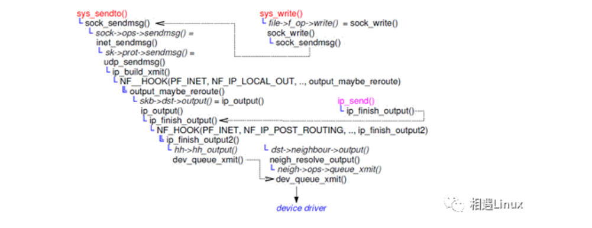

# Linux网络发包流程



```c
sys_write()
       file->f_op->write()(sock_writev)(注0)
          sock_writev()
            sock_sendmsg()
            sock->ops->sendmsg()
                        (inet_sendmsg)
              structsock *sk = sock->sk;
                   sk->sk_prot->sendmsg();  (注1)
                     udp_sendmsg()
                       udp_push_pending_frames()
                            ip_push_pending_frames()
                                dst_output()
                                    ip_output()
                                         /ip_mc_output()
                                       ip_finish_output()
                                            dev_queue_xmit()

注0：
sock_map_fd()
  file->f_op =SOCK_INODE(sock)->i_fop =
             &socket_file_ops
注1:
       struct proto_opsinet_stream_ops = {
              …
              .sendmsg =      inet_sendmsg
              …
}
       struct proto udp_prot ={
                     …
              .name =         "UDP",
              .sendmsg =      udp_sendmsg,
              …
              }
```

**网络收包简单总结：**

 首先网卡驱动申请一个著名的数据结构sk_buffer，根据数据包中的网络类型 type = skb->protocol(L3层 ipv4 or ipv6 ..) ，去调用提前注册在内核中的ipv4 or ipv6 ..协议处理函数，比如调用ip_rcv(),然后进一步解包，比如根据目的MAC地址和目的IP地址确定是否转发包，然后从包中解出是TCP or UDP，同样调用内核中注册好的回调函数处理，然后根据网络包的信息(hash一下，怎么hash看源码:) )对接上收包之前sys_recvfrom()建立的sock,最后进一步唤醒等待收包的进程。

**网络发包简单总结：**

发包相对容易理解一些，比如首先调用sys_sendto()，比如在L4层确定TCP or UDP，同样调用L4层注册好的函数，L3层根据路由表子系统确定IP地址,L2层根据邻居子系统确定MAC地址，然后传给网卡驱动发包。

当然,网络子系统非常复杂，不过这些对了解网络流程，对排查网络故障会起很大的作用。